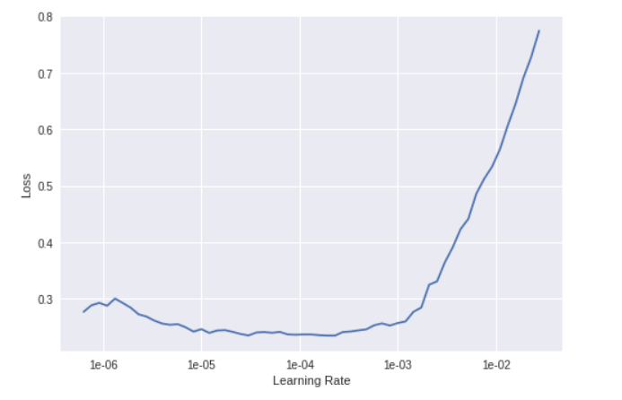
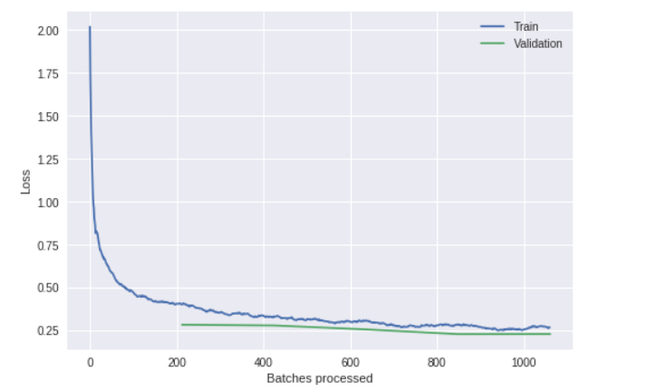
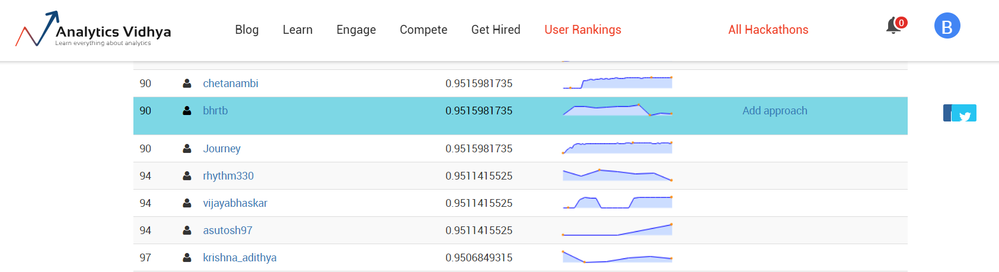
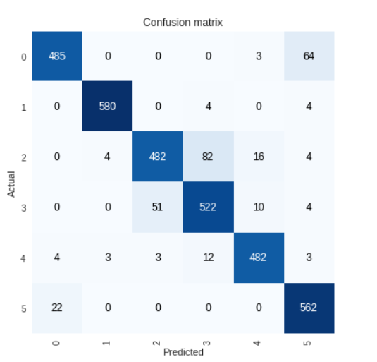
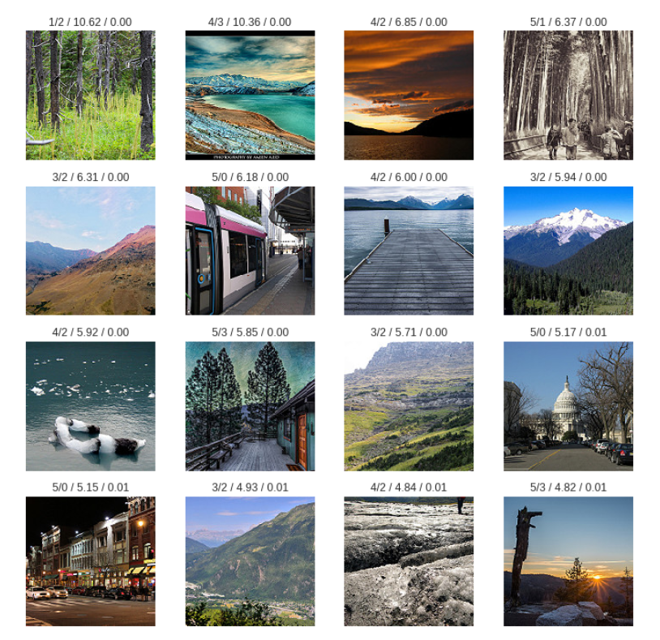

# Intel-Scene-Classification
Solution of Intel Scene Classification challenge getting accuracy of 94.2 %

[Competition Link](https://datahack.analyticsvidhya.com/contest/practice-problem-intel-scene-classification-challe/)


[Colab Link](https://colab.research.google.com/drive/1NggCLuuEJnxQo7DVThrDUW1yjEQn3XaN#scrollTo=xJUjD9s5g8s5)


The Intel scene classification problem contained around 20000 images belonging to 6 classes i.e buildings, forests, glacier, mountain, sea and street. The challenge is to classify the images with more than 90% accuracy. The data for this challenge can be found [here](https://www.kaggle.com/nitishabharathi/scene-classification).

Following are the classes and labels of the images given in the challenge:


```
'buildings' -> 0
'forest' -> 1
'glacier' -> 2
'mountain' -> 3
'sea' -> 4
'street' -> 5
```

The labels for the images are given in a csv file (for both train and test) which contains two colums, one for the image name and other for the label of the image as shown below:

| Variable	| Definition |
| ------------- | ----------------- |
| image_name	| Name of the image in the dataset (ID column) |
| label | Category of natural scene (target column) |
 
 
To solve this problem we have utilised [Fastai vision](https://docs.fast.ai/vision.html) library which contains all the necessary funtions for computer vision tasks and allows us to quickly train and test the model with best parameters.

To use fastai library first task is to create a databunch from the images so that we can quickly load the images for training and testing in batches. For this purpose we'll use Fastai's [ImageDataBunch class](https://github.com/fastai/fastai/blob/master/fastai/vision/data.py#L85). Since the image details are given in csv format, we'll use the [from_csv](https://github.com/fastai/fastai/blob/master/fastai/vision/data.py#L123) method of ImageDataBunch class.
 
 
 
 






